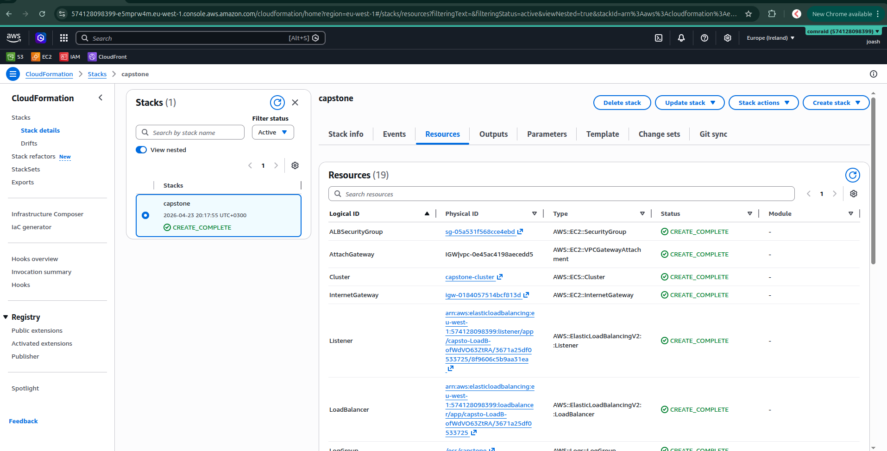
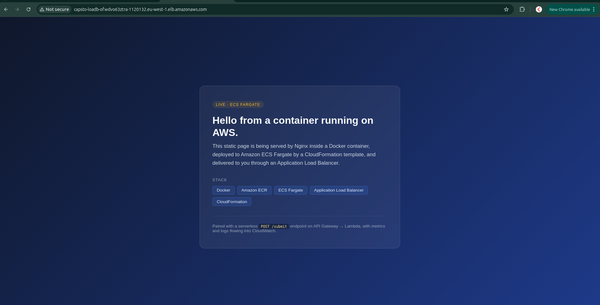
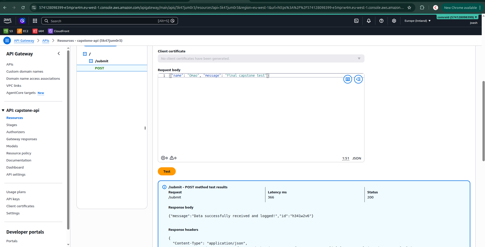
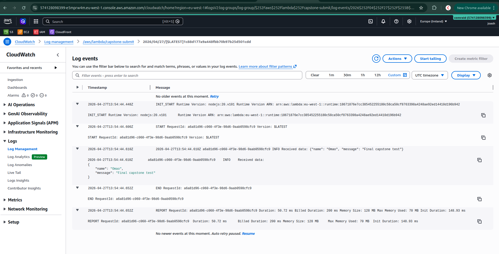
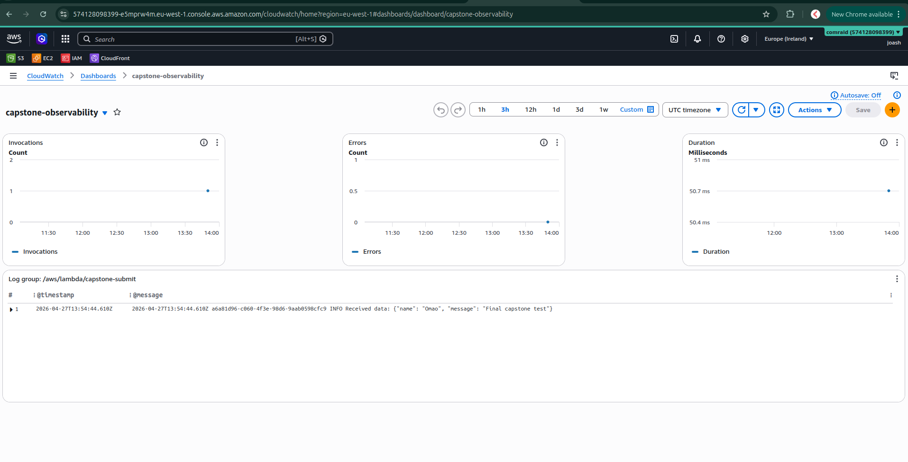

# Capstone: Serverless API & Containerized Web App

A hybrid cloud-native application that brings together Infrastructure as Code,
Containerization, Serverless, and Observability into one working system on AWS.

The project deploys a Serverless REST API that receives JSON data via Amazon
API Gateway and AWS Lambda, paired with a Containerized Web Application running
on Amazon ECS Fargate, with the entire ECS infrastructure provisioned by an
AWS CloudFormation template. CloudWatch captures logs and surfaces metrics in
a custom dashboard.

---

## Architecture

```
                         Internet
                ┌────────────┴────────────┐
                ▼                         ▼
     ┌──────────────────┐      ┌──────────────────┐
     │   API Gateway    │      │  Application LB  │
     │   POST /submit   │      │ (public DNS name)│
     └────────┬─────────┘      └────────┬─────────┘
              │                         │
              ▼                         ▼
     ┌──────────────────┐      ┌──────────────────┐
     │  AWS Lambda      │      │  ECS Fargate     │
     │  (Node.js 20)    │      │  Nginx container │
     └────────┬─────────┘      └────────┬─────────┘
              │                         │
              └────────────┬────────────┘
                           ▼
                  ┌────────────────┐
                  │   CloudWatch   │
                  │ Logs · Metrics │
                  │   Dashboard    │
                  └────────────────┘
```

| Layer                  | AWS Service                            | Role                                              |
| ---------------------- | -------------------------------------- | ------------------------------------------------- |
| Infrastructure as Code | AWS CloudFormation                     | Provisions the ECS stack from one template        |
| Containerized App      | Amazon ECS (Fargate) + Application LB  | Hosts the Nginx web app, load-balanced            |
| Serverless API         | Amazon API Gateway (REST) + AWS Lambda | Accepts `POST /submit`, logs payloads, returns ID |
| Observability          | Amazon CloudWatch                      | Captures logs and powers the custom dashboard     |

---

## Repository structure

```
.
├── infrastructure.yml      # CloudFormation template (VPC, ECS cluster, service, ALB, IAM, logs)
├── lambda-api/
│   └── index.js            # Lambda handler
├── webapp/
│   ├── Dockerfile          # Nginx base image + custom landing page
│   └── index.html          # Static landing page served by the container
├── docs/
│   └── screenshots/        # Evidence of successful deployment
└── README.md
```

---

## Prerequisites

- An AWS account with the AWS CLI v2 installed and configured (`aws configure`)
- Docker
- A region selected — examples below use `eu-west-1` (Ireland)

Set environment variables for the deployment session:

```bash
export AWS_REGION=eu-west-1
export AWS_ACCOUNT_ID=$(aws sts get-caller-identity --query Account --output text)
export ECR_REPO=capstone-webapp
export STACK_NAME=capstone
```

---

## Step 1 — The Containerized Web App

A static page is served by an Nginx container running on Amazon ECS Fargate
behind an Application Load Balancer. The image is built from
`webapp/Dockerfile`, pushed to Amazon ECR, and deployed with a CloudFormation
template that provisions the entire stack.

### Build and push the container image to ECR

```bash
# Create the ECR repository
aws ecr create-repository --repository-name $ECR_REPO --region $AWS_REGION

# Authenticate Docker with ECR
aws ecr get-login-password --region $AWS_REGION \
  | docker login --username AWS --password-stdin \
    $AWS_ACCOUNT_ID.dkr.ecr.$AWS_REGION.amazonaws.com

# Build, tag, and push the image
cd webapp
docker build -t $ECR_REPO:latest .
docker tag $ECR_REPO:latest \
  $AWS_ACCOUNT_ID.dkr.ecr.$AWS_REGION.amazonaws.com/$ECR_REPO:latest
docker push \
  $AWS_ACCOUNT_ID.dkr.ecr.$AWS_REGION.amazonaws.com/$ECR_REPO:latest
cd ..
```

### Deploy the ECS infrastructure with CloudFormation

```bash
aws cloudformation deploy \
  --stack-name $STACK_NAME \
  --template-file infrastructure.yml \
  --capabilities CAPABILITY_IAM \
  --region $AWS_REGION \
  --parameter-overrides \
    ImageUri=$AWS_ACCOUNT_ID.dkr.ecr.$AWS_REGION.amazonaws.com/$ECR_REPO:latest
```

The template provisions a VPC with two public subnets across two Availability
Zones, an Internet Gateway and route table, security groups, an Application
Load Balancer with a target group and listener, an IAM execution role, a
CloudWatch log group, an ECS cluster, a Fargate task definition referencing the
ECR image, and an ECS service that keeps the task running and registered
behind the load balancer.



Once the stack reaches `CREATE_COMPLETE`, retrieve the public URL from the
stack outputs:

```bash
aws cloudformation describe-stacks \
  --stack-name $STACK_NAME \
  --region $AWS_REGION \
  --query "Stacks[0].Outputs[?OutputKey=='WebAppURL'].OutputValue" \
  --output text
```

Open the URL in a browser to confirm the web application is live.



---

## Step 2 — The Serverless API

An AWS Lambda function acts as a backend receiver for JSON payloads. Amazon
API Gateway exposes the Lambda through a `POST /submit` endpoint deployed to a
`prod` stage.

### Deploy the Lambda function

Package and create the function:

```bash
cd lambda-api
zip function.zip index.js

aws lambda create-function \
  --function-name capstone-submit \
  --runtime nodejs20.x \
  --role arn:aws:iam::$AWS_ACCOUNT_ID:role/lambda-basic-execution \
  --handler index.handler \
  --zip-file fileb://function.zip \
  --region $AWS_REGION
cd ..
```

> The `lambda-basic-execution` IAM role must exist beforehand (trust policy:
> `lambda.amazonaws.com`; managed policy: `AWSLambdaBasicExecutionRole`).

The function accepts a JSON payload, prints it to `console.log()` (which sends
it to CloudWatch), and returns a `200` response with a generated submission ID.


### Create the REST API in API Gateway

In the AWS Console:

1. **API Gateway** → **Create API** → **REST API** → **Build**
2. Name: `capstone-api` · Endpoint type: **Regional**
3. Create resource `/submit`
4. On `/submit`, create a **POST** method with:
   - Integration type: **Lambda function**
   - **Lambda proxy integration**: enabled
   - Lambda function: `capstone-submit`
5. **Deploy API** to a new stage named `prod`
6. Copy the **Invoke URL** displayed at the top of the stage page

### Test the endpoint

```bash
curl -X POST <invoke-url>/submit \
  -H "Content-Type: application/json" \
  -d '{"name": "Faith", "message": "Hello from curl"}'
```

Expected response:

```json
{
  "message": "Data successfully received and logged!",
  "id": "fw8ybg9w"
}
```



---

## Step 3 — Observability with CloudWatch

CloudWatch captures every Lambda invocation. A custom dashboard surfaces the
metrics and recent payloads in a single view.

### Generate traffic and verify logs

Sending several requests to the API populates Lambda's log group with the
incoming payloads:

```bash
for i in 1 2 3 4 5; do
  curl -X POST <invoke-url>/submit \
    -H "Content-Type: application/json" \
    -d "{\"name\": \"test $i\", \"message\": \"request $i\"}"
  echo
done
```

Each invocation writes a `Received data: {...}` entry to the
`/aws/lambda/capstone-submit` log group, alongside the standard
`START`/`END`/`REPORT` lines emitted by the Lambda runtime.



### Build the CloudWatch Dashboard

In the AWS Console:

1. **CloudWatch** → **Dashboards** → **Create dashboard**
2. Name: `capstone-observability`
3. Add widgets:
   - **Line widget** — `AWS/Lambda` → `Invocations` for `capstone-submit` (Statistic: `Sum`)
   - **Line widget** — `AWS/Lambda` → `Errors` for `capstone-submit` (Statistic: `Sum`)
   - **Line widget** — `AWS/Lambda` → `Duration` for `capstone-submit` (Statistic: `Average`)
   - **Logs Insights widget** — log group `/aws/lambda/capstone-submit`:
     ```
     fields @timestamp, @message
     | filter @message like /Received data/
     | sort @timestamp desc
     | limit 20
     ```
4. Save the dashboard



---

## Verification summary

The deployment satisfies the four stated goals of the project:

- **Infrastructure as Code** — `infrastructure.yml` provisions a complete ECS Fargate stack (VPC, subnets, ALB, target group, security groups, IAM execution role, ECS cluster, task definition, and service) in a single `aws cloudformation deploy` invocation.
- **Containerized Application** — A Docker image built from `webapp/Dockerfile` is pushed to Amazon ECR and deployed to ECS Fargate, served behind an Application Load Balancer.
- **Serverless API** — Amazon API Gateway exposes a `POST /submit` endpoint that integrates with an AWS Lambda function. The Lambda accepts JSON payloads, logs them to CloudWatch, and returns a success response with a generated submission ID.
- **Observability** — A custom CloudWatch Dashboard (`capstone-observability`) visualizes Lambda invocations, errors, duration, and the most recent received payloads.
